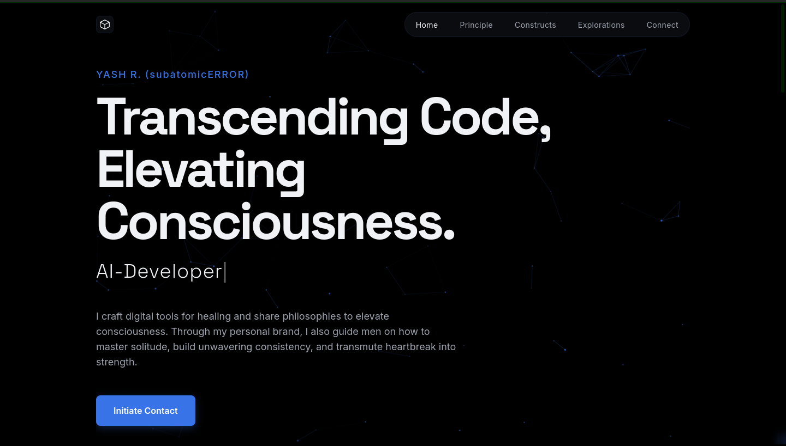

# Yash Ramteke's Portfolio Website

<!--
IMPORTANT: After running this script and before your first 'git add/commit' if you haven't already:
1.  Take a high-quality screenshot of your website.
2.  Save it as 'screenshot.png' (or a similar name) inside the 'docs/' directory.
3.  If you use a different filename or path, update the 'src' attribute in the markdown below.
Example: 
-->

## Description
This is my personal portfolio website, designed to showcase my skills, projects, and professional experience. Built with modern web development practices, it offers a responsive, fast, and visually appealing experience across various devices.

## Features
*   **Responsive Design:** Adapts seamlessly to different screen sizes (desktop, tablet, mobile).
*   **Dynamic Portfolio:** Features a collection of my projects with descriptions and links.
*   **Interactive UI:** Enhances user engagement with smooth animations and transitions.
*   **Skill Showcase:** Highlights my technical proficiencies.
*   **Contact Form:** Provides an easy way for visitors to connect with me.
*   **(Add more specific features of your site here, e.g., Blog Integration, Dark Mode Toggle, etc.)**

## Technologies Used
*   **Frontend:** React, TypeScript, Vite
*   **Styling:** Tailwind CSS (or other CSS framework/library you've used)
*   **Deployment:** GitHub Pages, gh-pages
*   **Version Control:** Git

### Prerequisites

*   Node.js (LTS version recommended)
*   npm (Node Package Manager)

## License
Distributed under the MIT License. See `LICENSE` for more information.

Project Link: [https://github.com/subatomicERROR/iamyashramteke](https://github.com/subatomicERROR/iamyashramteke)
